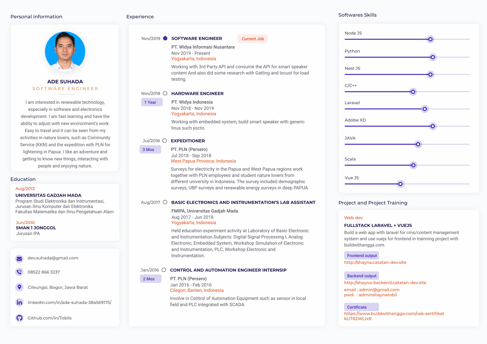

<!--
**Tobils/Tobils** is a ✨ _special_ ✨ repository because its `README.md` (this file) appears on your GitHub profile.
Here are some ideas to get you started:
-->

    <h1>Hi there 👋, I'm Tobil</h1>
    <em> 
        <!-- Hardware-Software Developer with ±3 years experience working on Firmware or Embedded Systems -->
         
    </em>
     
     
    
    

      
       
    

### Current activities

<!--
- 🔭 I’m currently working on ...
- 🌱 I’m currently learning ...
- 👯 I’m looking to collaborate on ...
- 🤔 I’m looking for help with ...
- 💬 Ask me about ...
- 📫 How to reach me: ...
- 😄 Pronouns: ...
- ⚡ Fun fact: ...
-->
